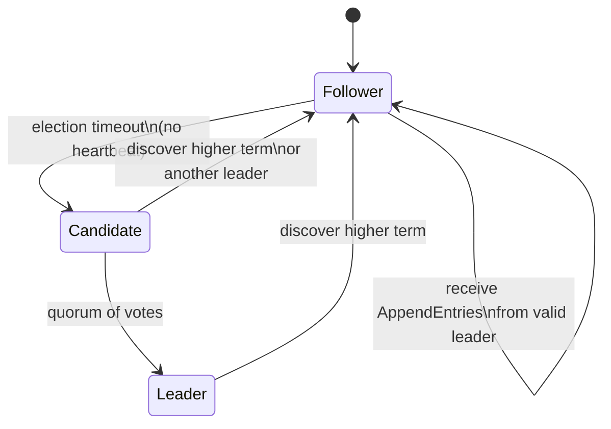

# Interview revision guide — raft-kv

Quick reference to revise Raft concepts and explain **this project's** architecture in interviews. Read top-to-bottom once, then use the [cheat sheet](#cheat-sheet-30-second-version) before a call. For transport choices, see [Why gRPC?](#why-grpc-vs-rest-and-alternatives).

---

## Elevator pitch (30–45 seconds)

> I built a **3-node distributed key-value store** in Go where all writes go through **Raft consensus**. Each node runs a gRPC server. Nodes elect a **leader**, the leader appends client writes to a **replicated log**, and once a **quorum** acknowledges an entry, it is **committed** and applied to an in-memory map. Followers stay in sync via **AppendEntries** heartbeats. The project demonstrates leader election, log replication, commit rules, and a minimal Put/Get API — not production persistence or membership changes.

---

## Problem this solves

| Without consensus | With Raft (this project) |
|-------------------|--------------------------|
| Multiple nodes can accept writes independently → **split brain**, inconsistent data | Exactly **one leader** accepts writes at a time |
| Crashes leave nodes diverged | Replicated log + quorum → **same order** of operations on a majority |
| No clear way to pick who is authoritative | **Elections** + monotonic **terms** pick one leader safely |

**One-line:** Raft turns a set of unreliable servers into one **consistent, replicated state machine**.

---

## Raft in 5 ideas

1. **Term** — Logical clock / epoch number. At most one leader per term. Higher term wins conflicts.
2. **Three roles** — Follower (passive), Candidate (asks for votes), Leader (handles replication).
3. **Log** — Ordered list of commands. Leader replicates; followers copy. Committed entries are durable on a quorum.
4. **Quorum** — Majority of nodes (`(N/2)+1`). Guarantees any two majorities overlap → no two leaders in same term.
5. **Safety** — Leader Completeness: if an entry is committed, it appears in the log of any future leader.

---

## Node states (know this cold)



| State | Who initiates RPCs | In this codebase |
|-------|-------------------|------------------|
| **Follower** | Nobody (responds only) | Default on startup; reset timer on `AppendEntries` / vote grant |
| **Candidate** | `RequestVote` to all peers | `StartElection()` |
| **Leader** | `AppendEntries` to all peers | After quorum; `broadcastHeartbeat()` |

**Interview tip:** Say followers only respond — that bounds RPC load and simplifies reasoning.

---

## Architecture of *this* project

```
┌─────────────────────────────────────────────────────────┐
│  cmd/raft-kv/main.go                                     │
│  • Read NODE_ID, NODE_PORT, PEERS                        │
│  • Start gRPC server (RaftService)                       │
│  • Dial peers, wait until connections READY              │
│  • node.Run() → election timer loop                      │
└──────────────────────────┬──────────────────────────────┘
                           │
┌──────────────────────────▼──────────────────────────────┐
│  raft/raft.go — RaftNode                                   │
│  • State: term, votedFor, log, commitIndex, lastApplied  │
│  • Leader: nextIndex, matchIndex per peer                  │
│  • State machine: kvStore map[string]string                │
│  • RPC handlers: RequestVote, AppendEntries, Put, Get      │
└──────────────────────────┬──────────────────────────────┘
                           │ gRPC
┌──────────────────────────▼──────────────────────────────┐
│  proto/raft.proto — Vote / AppendEntries / Put / Get      │
└───────────────────────────────────────────────────────────┘
```

### What each layer does

| Layer | Responsibility |
|-------|----------------|
| **main.go** | Process wiring: env config, peer connections, graceful shutdown on SIGINT |
| **RaftNode** | Full Raft logic + KV apply |
| **proto** | RPC contracts between nodes and clients |
| **docker-compose** | 3 peers, full mesh `PEERS`, ports 5001–5003 on host |

---

## Persistent vs volatile state (Raft paper → your struct)

### Persistent (should survive crash — *in your project: in-memory only*)

| Raft field | Your field | Purpose |
|------------|------------|---------|
| `currentTerm` | `currTerm` | Detect stale leaders/candidates |
| `votedFor` | `votedFor` | At most one vote per term per node |
| `log[]` | `log []*LogEntry` | Replicated command history |

### Volatile on all servers

| Raft field | Your field |
|------------|------------|
| `commitIndex` | `commitIndex` (starts at -1) |
| `lastApplied` | `lastApplied` (starts at -1) |

### Volatile on leader only

| Raft field | Your field |
|------------|------------|
| `nextIndex[peer]` | `nextIndex` — next log slot to send |
| `matchIndex[peer]` | `matchIndex` — highest known replicated index on peer |

**Interview answer:** "I modeled the paper's state split in `RaftNode`. Production would persist term, vote, and log to disk before responding to RPCs."

---

## RPCs — what to say for each

### 1. `RequestVote` (election)

**Candidate sends:** `term`, `candidateId`, `lastLogIndex`, `lastLogTerm`

**Follower checks:**
- Reject if `req.Term < currTerm`
- If `req.Term > currTerm`, step down and update term
- Grant vote only if:
  - haven't voted for someone else this term (`votedFor == -1` or same candidate), **and**
  - candidate's log is **at least as up-to-date** (compare last term, then index)

**Your code:** `StartElection()`, `RequestVote()` in `raft/raft.go`

**Why log comparison matters:** Prevents a lagging node from becoming leader and overwriting committed entries.

---

### 2. `AppendEntries` (heartbeat + replication)

**Leader sends:** `term`, `leaderId`, `prevLogIndex`, `prevLogTerm`, `entries[]`, `leaderCommit`

**Follower checks:**
- Reject if `term < currTerm`
- Reset election timer (your `heartbeatC` channel)
- **Consistency check:** entry at `prevLogIndex` must exist and have term `prevLogTerm`
- If OK: append new entries, advance `commitIndex` from `leaderCommit`, call `applyLogs()`

**Empty `entries`** = heartbeat only (keeps followers from starting election).

**Your timings:**
- Heartbeat ticker: **50 ms**
- Election timeout: random **300–600 ms** (must be >> heartbeat)

**On mismatch:** leader decrements `nextIndex[peer]` and retries (log backtracking).

---

### 3. `Put` / `Get` (client API)

| RPC | Behavior in your project |
|-----|--------------------------|
| **Put** | Leader-only. Append `PUT key value` to log → trigger replication → **block until `commitIndex >= entryIndex`** |
| **Get** | Any node. Read local `kvStore` — **not** routed through Raft |

**Important honesty for interviews:** Writes are consensus-backed; reads are **local** and can be stale on followers. Production systems often use `ReadIndex`, lease reads, or follower redirects.

---

## End-to-end flows

### A. Leader election (follower timeout)

```
Follower                    Peer B                    Peer C
   |                           |                         |
   |  election timer fires     |                         |
   |  → become Candidate       |                         |
   |  term++                   |                         |
   |  vote for self            |                         |
   |-------- RequestVote ----->|                         |
   |-------- RequestVote ------------------------------->|
   |<------- vote granted -----|                         |
   |<------- vote granted -------------------------------|
   |  quorum reached → Leader  |                         |
   |  start heartbeat loop     |                         |
```

**Quorum formula in code:** `(len(peers)+1)/2 + 1`  
For 3 nodes: need **2** votes (self + 1 peer).

---

### B. Write path (`Put`)

```
Client          Leader              Follower A         Follower B
  |               |                      |                  |
  |-- Put ------->|                      |                  |
  |               | append log[index]    |                  |
  |               |-- AppendEntries ---->|                  |
  |               |-- AppendEntries ----------------------->|
  |               |<-- success ----------|                  |
  |               |<-- success ---------------------------|
  |               | quorum on index → commitIndex         |
  |               | applyLogs → kvStore                   |
  |<-- success ---|                      | (also apply)     |
```

**Commit rule in your code:** Only commit entries from the **current leader term** once replicated on a quorum (`matchIndex` scan). This matches Raft Figure 8 safety.

---

### C. Apply path (state machine)

Committed log entries → `applyLogs()`:

```go
// Command format: "PUT key value"
n.kvStore[parts[1]] = parts[2]
```

The **log** is the source of truth; `kvStore` is a **projection** (derived state).

---

## Key mechanisms in your code

| Mechanism | Where | Why |
|-----------|-------|-----|
| Election timer reset | `heartbeatC` on vote grant / AppendEntries | Prevents unnecessary elections while leader is alive |
| Randomized timeout | `GetRandomElectionTimeout()` 300–600 ms | Reduces split votes |
| Parallel vote RPCs | goroutine per peer in `StartElection` | Faster election |
| Parallel replication | goroutine per peer in `sendHeartbeat` | Lower replication latency |
| `sync.Mutex` on `RaftNode` | all handlers | Single-node concurrency safety |
| gRPC conn ready wait | `main.go` `waitUntilConnReady` | Avoids failed elections at Docker startup |
| Put waits on commit | polling loop in `Put` | Strong write acknowledgment to client |

---

## Safety properties (interview favorites)

| Property | Explanation | How your project helps |
|----------|-------------|-------------------------|
| **Election safety** | At most one leader per term | Terms + quorum + single vote per term |
| **Leader completeness** | Committed entries appear on future leaders | Log-up-to-date vote rule |
| **Log matching** | Same index+term → same prefix | `prevLogIndex` / `prevLogTerm` check on append |
| **State machine safety** | Same commit order → same applied state | Quorum replication + deterministic apply |

---

## Why gRPC? (vs REST and alternatives)

Interviewers often ask why a distributed system uses gRPC instead of “plain HTTP” or REST. Here is a structured answer tied to **this project**.

### Short answer (15 seconds)

> Raft nodes talk to each other constantly — elections, heartbeats every 50 ms, log replication with structured payloads. gRPC gives **typed RPCs**, **efficient binary encoding**, and **HTTP/2 multiplexing** on persistent connections. REST/JSON would work for a demo, but gRPC matches how production systems like etcd implement their Raft transport, and the `.proto` file acts as a strict contract between nodes.

### Medium answer (45 seconds)

> I separated **consensus RPCs** (`RequestVote`, `AppendEntries`) from the **client API** (`Put`, `Get`), but all four live on one gRPC service. Peers hold long-lived client connections and invoke methods directly — no URL routing or manual JSON parsing. Protobuf defines exact field types (`int64 term`, repeated log entries), and the generated Go code gives me compile-time safety. For a 3-node cluster with frequent heartbeats, binary protobuf over HTTP/2 is lighter than REST/JSON, and the RPC style maps naturally onto the Raft paper’s “remote procedure calls.”

### If they push: “Would REST have been fine?”

Yes, for a learning project either works. Be honest:

> Correctness comes from Raft, not from gRPC. I could expose Put/Get as REST and keep internal Raft over gRPC — many real systems split external HTTP from internal RPC. I chose gRPC end-to-end for consistency and because etcd, Consul, and similar systems use gRPC or an equivalent RPC layer internally.

---

### gRPC vs REST — comparison for *this* codebase

| Dimension | gRPC (what you use) | REST over HTTP/1.1 + JSON |
|-----------|---------------------|---------------------------|
| **Contract** | `raft.proto` — schema-first, generated types | Hand-written handlers + JSON structs (easy to drift) |
| **Raft RPC shape** | `RequestVote(req) → res` maps 1:1 to paper | You design URLs (`POST /vote`) and status-code semantics yourself |
| **Payload size** | Protobuf binary — compact for `AppendEntries` with log slices | JSON verbose; log replication sends more bytes |
| **Connections** | HTTP/2, one conn per peer, many RPCs multiplexed | Often one request per connection (HTTP/1.1) or need connection pooling |
| **Latency pattern** | Persistent stubs in `peers` map — good for 50 ms heartbeats | New request overhead unless you pool keep-alive carefully |
| **Errors** | gRPC status codes + app fields in response (`VoteGranted: false`) | HTTP 4xx/5xx vs 200-with-error-body — team convention needed |
| **Tooling** | `grpcurl`, protoc ecosystem | curl, Postman — easier for casual demos |
| **Browser clients** | Awkward (needs grpc-web proxy) | Native |
| **Human debugging** | Binary on the wire | JSON is readable in logs |

**Interview line:** REST optimizes for **public, human-facing APIs**; gRPC optimizes for **service-to-service** calls with strict schemas and high churn — which describes Raft peer traffic.

---

### Other alternatives (name them if asked)

| Alternative | When it fits | Why not here (or “what I’d say”) |
|-------------|--------------|-----------------------------------|
| **Raw TCP + custom framing** | Maximum control, minimal deps | You reimplement versioning, framing, backpressure, and codegen — gRPC already solves that |
| **HTTP/2 + JSON (no gRPC)** | Want multiplexing but JSON | Lose protobuf codegen and RPC stubs; still hand-roll routing |
| **Message queue (NATS, Kafka)** | Event-driven, async workflows | Raft needs **synchronous request/response** (vote granted? append success?) with tight timeouts |
| **ZeroMQ / nanomsg** | Low-latency pub/sub or fan-out | Raft is point-to-point RPC with reply semantics, not fire-and-forget |
| **Cap’n Proto / FlatBuffers** | Extreme perf, zero-copy | Smaller ecosystem than protobuf+gRPC in Go; overkill for this scope |
| **Twirp / Connect** | RPC over HTTP with simpler semantics | Valid choice; gRPC is more common in infra/distributed systems interviews |

You do **not** need to disparage other options — show you picked gRPC for **typed peer RPCs + industry precedent**, not because REST is “wrong.”

---

### How this project uses gRPC (concrete hooks)

Use these if the interviewer wants “show me you understand your stack”:

1. **One service, two roles** — `RaftService` serves both inter-node Raft RPCs and client Put/Get (`proto/raft.proto`).
2. **Server:** `RegisterRaftServiceServer(grpcServer, node)` — `RaftNode` implements the generated interface.
3. **Client:** `peers map[int32]pb.RaftServiceClient` — leader/candidate calls peers without HTTP routing.
4. **Long-lived connections** — `grpc.NewClient` + `waitUntilConnReady` in `main.go` so election RPCs don’t race TCP setup.
5. **Deadlines** — `context.WithTimeout` on vote (2 s) and append (100 ms) RPCs in `raft.go`.
6. **Tradeoff you accept** — no TLS (`insecure`), no gRPC reflection; fine for local Docker, not for production.

---

### Sample Q&A phrasing

**“Why gRPC?”**

> Peer nodes exchange structured RPCs at high frequency. gRPC gives me a single `.proto` contract, generated client/server code, and efficient HTTP/2 connections. The Raft logic stays transport-agnostic in spirit, but gRPC reduces boilerplate and matches how systems like etcd expose Raft internally.

**“Why not REST?”**

> REST is a great fit for external APIs and browser clients. My hot path is leader → follower AppendEntries on a timer. That is service-to-service RPC with strict types, not resource-oriented HTTP. I could expose Put/Get as REST behind a gateway and keep gRPC internally — that is a common production split.

**“What would you change at scale?”**

> Add TLS/mTLS between peers, connection health checks, retries with idempotency where safe, and possibly separate ports or services for client traffic vs Raft replication so you can firewall and rate-limit differently.

---

## Common interview questions & sample answers

### "Why Raft over Paxos?"

Raft is **designed for understandability**: strong leader, clear states, same safety as Multi-Paxos for practical systems. Easier to implement and debug — good for a portfolio project.

### "What happens if the leader crashes?"

Followers stop receiving heartbeats → election timeout → new candidate → new leader in a higher (or same) term. Uncommitted entries from the old leader may be discarded; committed entries survive on a quorum and will appear on the new leader's log.

### "What is a term?"

A monotonically increasing epoch. Used as a logical clock: stale leaders/candidates with old terms are ignored. Each election bumps the term.

### "Why majority/quorum?"

Any two majorities in an N-node cluster overlap in at least one node. That overlap carries the latest committed data, preventing two leaders from both believing they have quorum in the same term.

### "Heartbeats vs election timeout?"

Heartbeats must arrive **much more often** than the election timeout, or followers will start elections constantly. You use 50 ms vs 300–600 ms — healthy ratio.

### "How do you handle network partitions?"

Minority partition cannot elect a leader (no quorum) → **unavailable for writes**. Majority partition continues with one leader. When partition heals, nodes with stale terms step down when they see a higher term.

### "Is Get consistent?"

**Not linearizable** in your implementation — it reads local memory. Mention you'd fix this with leader reads, `ReadIndex`, or version checks in production.

### "What would you add for production?"

1. **Persistent log** (WAL on disk before responding)
2. **Snapshotting** + log compaction
3. **Client session IDs** / deduplication
4. **Automatic leader redirect** on Put/Get
5. **Linearizable reads**
6. **Membership changes** (joint consensus)
7. **Metrics, tracing, chaos testing**

### "Walk me through your codebase."

Suggested order:
1. `main.go` — bootstrap, peers, gRPC
2. `RaftNode` struct — state fields
3. `runElectionTimer` → `StartElection` → `RequestVote`
4. `broadcastHeartbeat` → `sendHeartbeat` → `AppendEntries`
5. `applyLogs` — state machine
6. `Put` / `Get` — client boundary

---

## Design tradeoffs you made (good to volunteer)

| Choice | Benefit | Cost |
|--------|---------|------|
| In-memory store | Simple, fast to build | Data lost on restart |
| gRPC over REST | Typed peer RPCs, HTTP/2, protobuf; matches etcd-style infra | Harder to curl; no browser-native client without grpc-web |
| Leader-only Put | Correct Raft write path | Client must find leader |
| Local Get | Fast reads | Stale reads possible |
| Mutex over fine-grained locks | Easier to reason about | Contention under load |
| No snapshotting | Simpler log management | Log grows forever |

---

## Numbers to remember

| Constant | Value |
|----------|-------|
| Cluster size (compose) | 3 nodes |
| Quorum | 2 |
| Election timeout | 300–600 ms (random) |
| Heartbeat interval | 50 ms |
| RequestVote timeout | 2 s |
| AppendEntries timeout | 100 ms |
| gRPC port (container) | 50051 |
| Host ports | 5001, 5002, 5003 |

---

## Demo script for live interviews

If you can share screen or logs:

```bash
docker compose up --build
docker compose logs -f   # point out "is now the leader"

# Write (must hit leader's port, e.g. 5001)
grpcurl -plaintext -d '{"key":"name","value":"raft"}' \
  localhost:5001 raft.RaftService/Put

# Read
grpcurl -plaintext -d '{"key":"name"}' \
  localhost:5001 raft.RaftService/Get
```

Talking points while demoing:
- "Only the leader accepts Put."
- "After Put returns, the entry is committed on a quorum."
- "All nodes eventually apply the same log line to their map."

---

## Glossary

| Term | Meaning |
|------|---------|
| **Log entry** | `{ term, command }` — one replicated unit |
| **Commit** | Entry is safe on a quorum; will not be lost |
| **Apply** | Execute committed entry on state machine |
| **Heartbeat** | AppendEntries with no new entries |
| **Split vote** | No candidate gets quorum; new election after timeout |
| **Step down** | Leader/candidate becomes follower on higher term |

---

## Cheat sheet (30-second version)

```
Problem:  consistent replicated KV across failures
Algorithm: Raft — leader + replicated log + quorum
States:   Follower → Candidate → Leader
RPCs:     RequestVote (elect), AppendEntries (sync/heartbeat)
Write:    Put → leader log → replicate → quorum commit → apply kvStore
Read:     Get → local map (eventual on followers)
Safety:   terms, one vote/term, log-up-to-date election, prevLog match
Transport: gRPC + protobuf (peer RPCs + Put/Get); not REST — see Why gRPC section
Gap:      no disk, no snap, no linearizable read, no membership change
```

---

## Related reading

- [Raft paper (extended version)](https://raft.github.io/raft.pdf)
- [Raft user-facing site](https://raft.github.io/)
- Project README: [README.md](README.md)

---

*Use this doc to rehearse out loud: elevator pitch → one flow (Put) → **why gRPC** → one safety property → one production improvement.*
