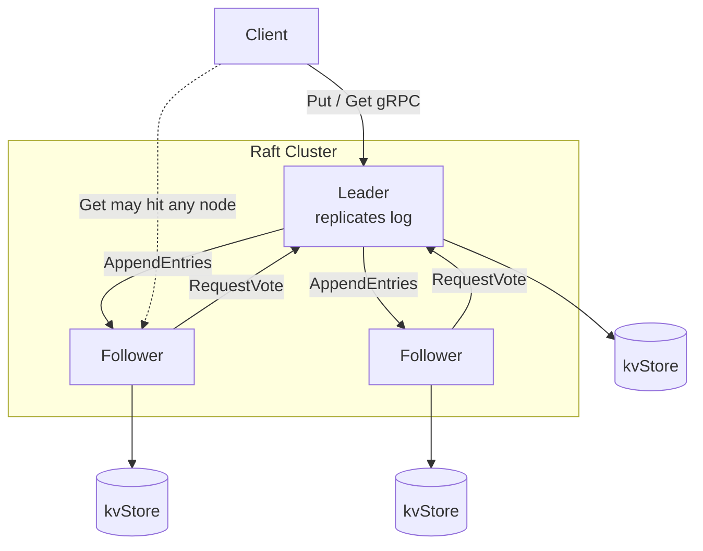

# raft-kv

A distributed, fault-tolerant key-value store built in Go. The cluster uses the [Raft consensus algorithm](https://raft.github.io/) to elect a leader, replicate a shared log, and apply committed writes to an in-memory store. Nodes communicate over gRPC.

This project is intended as a learning implementation of Raft: leader election, log replication, heartbeats, and a minimal client API (`Put` / `Get`).

**Interview prep:** See [INTERVIEW-GUIDE.md](INTERVIEW-GUIDE.md) for a concise revision of Raft concepts, architecture, flows, and common Q&A tied to this codebase.

## Features

- **Raft consensus** — follower, candidate, and leader roles with randomized election timeouts
- **Leader election** — `RequestVote` RPC with log-up-to-date checks
- **Log replication** — `AppendEntries` RPC for heartbeats and log sync
- **Replicated writes** — `Put` appends to the leader log and waits for commit before returning
- **Local reads** — `Get` reads from the node's in-memory store (see [Consistency](#consistency))
- **3-node Docker cluster** — ready-to-run `docker-compose` setup with host port mapping

## Architecture



Each node runs a single process that:

1. Serves the `RaftService` gRPC API
2. Dials configured peers and maintains outbound client connections
3. Runs an election timer; followers become candidates when the timer expires without hearing from a leader
4. Applies committed log entries (`PUT key value`) to a local `map[string]string`

### Request flow (write)

1. Client sends `Put` to the **leader**
2. Leader appends a log entry and triggers replication via `AppendEntries`
3. Once a quorum has replicated the entry **from the current term**, the leader commits it
4. All nodes apply the entry to their local KV store
5. Leader returns success to the client

### Request flow (read)

1. Client sends `Get` to any node
2. Node returns the value from its **local** store if the key exists

## Project layout

```
raft-kv/
├── cmd/raft-kv/          # Entry point: gRPC server, peer wiring, signals
├── raft/                 # Raft node implementation (election, replication, KV)
├── proto/                # Protobuf definitions and generated gRPC code
│   ├── raft.proto
│   ├── raft.pb.go
│   └── raft_grpc.pb.go
├── Dockerfile
├── docker-compose.yml
├── go.mod
└── go.sum
```

## Prerequisites

- **Go 1.24+** (for local builds)
- **Docker & Docker Compose** (for the multi-node cluster)
- **grpcurl** (optional, for manual API testing)
- **protoc**, `protoc-gen-go`, `protoc-gen-go-grpc` (only if regenerating protobuf stubs)

## Quick start (Docker Compose)

Build and start a 3-node cluster:

```bash
docker compose up --build
```

Each node listens on port `50051` inside the Docker network. Host mappings:

| Node   | Host port | Container |
|--------|-----------|-----------|
| peer1  | `5001`    | `peer1:50051` |
| peer2  | `5002`    | `peer2:50051` |
| peer3  | `5003`    | `peer3:50051` |

Watch logs to see leader election and heartbeats:

```bash
docker compose logs -f
```

Stop the cluster:

```bash
docker compose down
```

## Running locally

Build the binary:

```bash
go build -o raft-kv ./cmd/raft-kv
```

Run a single node (useful for debugging one process; a lone node elects itself leader):

```bash
export NODE_ID=1
export NODE_PORT=50051
export PEERS=""
./raft-kv
```

For a multi-node setup without Docker, run three processes with distinct `NODE_ID` / `NODE_PORT` values and set `PEERS` to the other nodes' `host:port` addresses (comma-separated). Peer hostnames in `PEERS` must use the `peer<id>` prefix so the node ID can be parsed (see [Configuration](#configuration)).

## Configuration

Environment variables read at startup:

| Variable    | Required | Description |
|-------------|----------|-------------|
| `NODE_ID`   | Yes      | Numeric ID of this node (e.g. `1`, `2`, `3`) |
| `NODE_PORT` | Yes      | TCP port for the gRPC server (e.g. `50051`) |
| `PEERS`     | No       | Comma-separated list of peers as `peer<id>:<port>` |

**Peer format:** each entry is `peerHost:port`, where `peerHost` must be named `peer<N>` (e.g. `peer2:50051`). The numeric suffix is used as the peer's Raft ID.

Example for node 1 in the compose cluster:

```bash
NODE_ID=1
NODE_PORT=50051
PEERS=peer2:50051,peer3:50051
```

On startup, the process dials each peer and waits up to 30 seconds for gRPC connections to reach `READY` before proceeding. This avoids election RPCs racing against idle TCP handshakes in Docker.

## gRPC API

Defined in [`proto/raft.proto`](proto/raft.proto).

### Raft RPCs (inter-node)

| RPC             | Purpose |
|-----------------|---------|
| `RequestVote`   | Candidate requests votes during an election |
| `AppendEntries` | Leader heartbeats and replicates log entries |

### Client RPCs

| RPC  | Request | Response | Notes |
|------|---------|----------|-------|
| `Put`| `key`, `value` | `success`, `leaderId` | **Must be sent to the leader.** Returns `success: false` with `leaderId: -1` if the target is not the leader. |
| `Get`| `key` | `success`, `value`, `leaderId` | Reads local state; `leaderId` is not populated by the current implementation. |

Log entries use the command format `PUT <key> <value>` (space-separated, value is the third token).

## Example usage (grpcurl)

Install [grpcurl](https://github.com/fullstorydev/grpcurl) if needed. The server uses plain-text gRPC (no TLS).

Find the leader from logs (look for `is now the leader`), then write through that node's host port. Example assuming **peer1** (port `5001`) is leader:

```bash
# Write a key (leader only)
grpcurl -plaintext -d '{"key":"foo","value":"bar"}' \
  localhost:5001 raft.RaftService/Put

# Read a key (any node; may be stale on followers until replication catches up)
grpcurl -plaintext -d '{"key":"foo"}' \
  localhost:5001 raft.RaftService/Get
```

If `Put` returns `"success": false`, retry against another node or check logs for the current leader.

## Implementation details

| Parameter | Value |
|-----------|-------|
| Election timeout | Random **300–600 ms** |
| Heartbeat interval | **50 ms** |
| Quorum | `(len(peers) + 1) / 2 + 1` |
| Vote RPC timeout | 2 s |
| AppendEntries RPC timeout | 100 ms |
| Storage | In-memory only (no persistence across restarts) |

### Consistency

- **Writes** are replicated through Raft and committed on a quorum before `Put` succeeds on the leader.
- **Reads** are served from each node's local store without going through Raft. Followers may briefly lag the leader, so `Get` on a non-leader can return stale or missing data until replication and apply complete. For strict read-your-writes semantics, read from the leader after a successful `Put`.

### Limitations

This is an educational implementation, not production-ready:

- No persistent storage or snapshotting
- No automatic client redirect to the leader on failed `Put` / `Get`
- No linearizable reads
- Fixed cluster membership (no joint consensus / configuration changes)
- Single-key `Put` only (no delete or compare-and-swap)
- Values cannot contain spaces (command parsing splits on spaces)

## Development

### Build

```bash
go build -o raft-kv ./cmd/raft-kv
```

### Regenerate protobuf code

From the repository root:

```bash
protoc --go_out=. --go_opt=paths=source_relative \
  --go-grpc_out=. --go-grpc_opt=paths=source_relative \
  proto/raft.proto
```

Requires `protoc`, `protoc-gen-go`, and `protoc-gen-go-grpc` on your `PATH`.

### Dependencies

- [google.golang.org/grpc](https://pkg.go.dev/google.golang.org/grpc)
- [google.golang.org/protobuf](https://pkg.go.dev/google.golang.org/protobuf)

## How it maps to Raft

| Raft paper concept | Implementation |
|--------------------|----------------|
| Persistent state: `currentTerm`, `votedFor`, log | `RaftNode.currTerm`, `votedFor`, `log` |
| Volatile leader state: `nextIndex`, `matchIndex` | Maps on the leader after election |
| Election | `StartElection`, `RequestVote` |
| Heartbeat / replication | `broadcastHeartbeat`, `sendHeartbeat`, `AppendEntries` |
| Commit & apply | `commitIndex`, `lastApplied`, `applyLogs` |
| State machine | In-memory `kvStore` updated from committed log |

Core logic lives in [`raft/raft.go`](raft/raft.go).

## License

No license file is included. All rights reserved by the repository owner unless stated otherwise.
